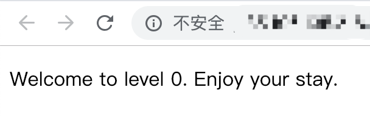
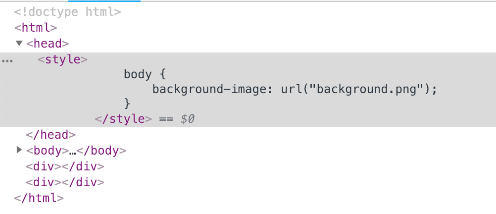
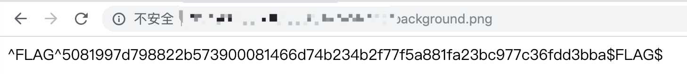

# A little something to get you started

## 0x00 Index



## 0x01 Inspect Element

There is an background image here but not show on the page.



```html
<style>
	body {
		background-image: url("background.png");
	}
</style>
```

## 0x02 Go Investigate

http://127.0.0.1:5001/xxxxxxxxxx/background.png



Here we get the FLAG

```
^FLAG^5081997d798822b573900081466d74b234b2f77f5a881fa23bc977c36fdd3bba$FLAG$
```