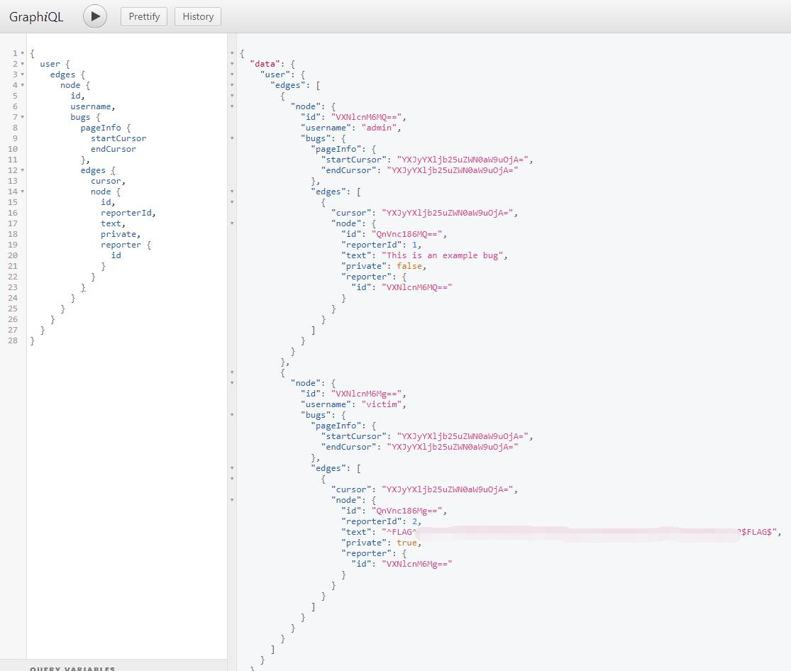

# BugDB v1 - FLAG0

## 0x00 Overview

Very direct and easy CTF. The purpose is more like taking a tour of Graphql.

## 0x01 FLAG

The left side is the QUERY and the RIGHT side is results.

There is also a very clear structure of data at very right side for reference.

So just make a query to loop through all the details of the data set.

```graphql
query{
  user {
    edges {
      node {
        id
        username
        bugs {
          pageInfo {
            startCursor
            endCursor
          }
          edges {
            cursor
            node {
              id
              reporterId
              text
              private
              reporter {
                id
              }
            }
          }
        }
      }
    }
  }
}
```

And here comes the flag.

