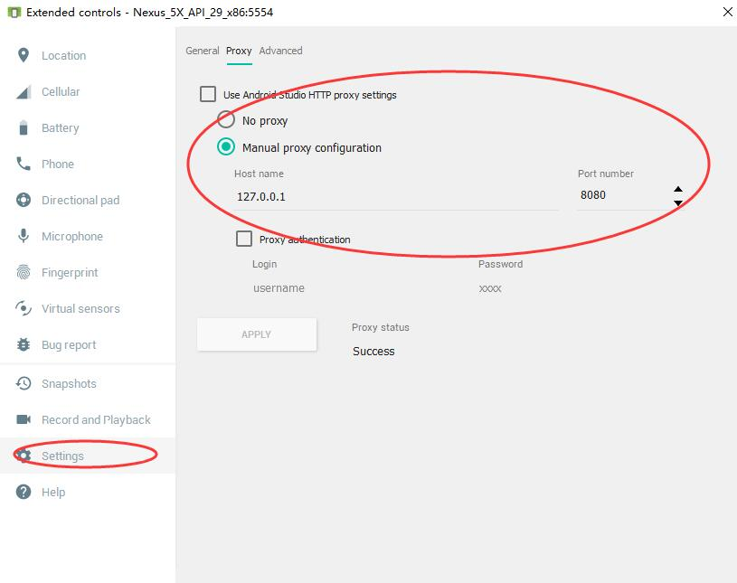
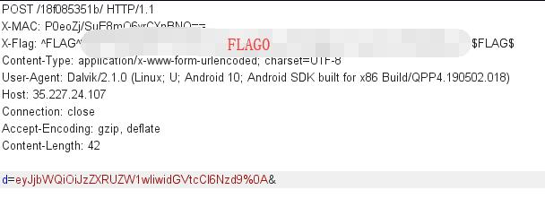

# H1 Thermostat - FLAG0

## 0x00 Configure Proxy

Set Android Emulator use the Burp proxy. 

## 0x01 Install APK

Just drug apk to install it into Android Emulator. And start the app.

Here comes the first FLAG in the POST request.

