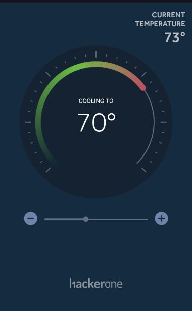
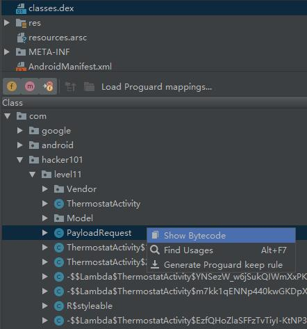
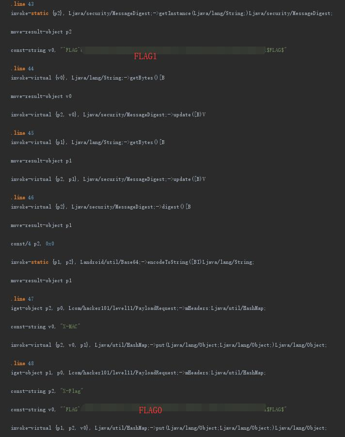

# H1 Thermostat - FLAG1

## 0x00 Params

There are different messages sending through. We can decode them with [base64][1].

| encoded                                          | readable                             |
| ------------------------------------------------ | ------------------------------------ |
| eyJjbWQiOiJnZXRUZW1wIn0                          | {"cmd":"getTemp"}                    |
| eyJ0ZW1wZXJhdHVyZSI6IDc3LCAic3VjY2VzcyI6IHRydWV9 | {"temperature": 77, "success": true} |
| eyJjbWQiOiJzZXRUZW1wIiwidGVtcCI6Nzd9             | {"cmd":"setTemp","temp":77}          |
| eyJjbWQiOiJzZXRUZW1wIiwidGVtcCI6NzB9             | {"cmd":"setTemp","temp":70}          |
| eyJzdWNjZXNzIjogdHJ1ZX0=                         | {"success": true}                    |

As the app shows current temperature is 73 and target 70.



Tried to manually change the temperature by encode 

```javascript
//eyJjbWQiOiJzZXRUZW1wIiwidGVtcCI6NzN9
base64({"cmd":"setTemp","temp":73})
```

But got an error as following

```json
//eyJzdWNjZXNzIjogZmFsc2UsICJlcnJvciI6ICJNQUMgZmFpbHVyZSJ9
{"success": false, "error": "MAC failure"}
```

## 0x01 Check Source

Something wrong with that MAC. Need go back to check the source for some help.



```
classes.dex -> com -> hacker101 -> level11 -> PlayloadRequest
```

Both flags can be found here.



[1]: https://www.base64decode.org/