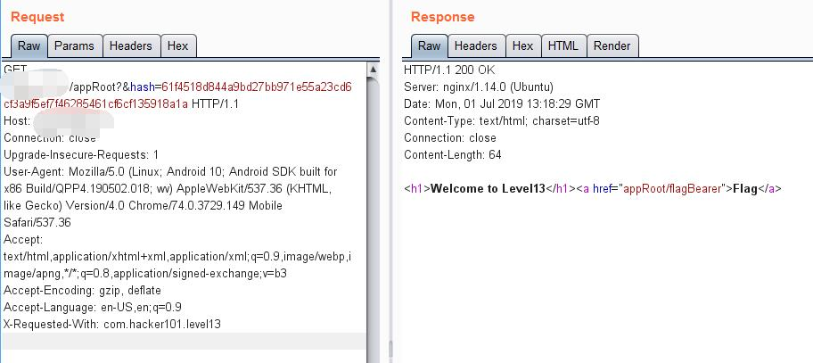
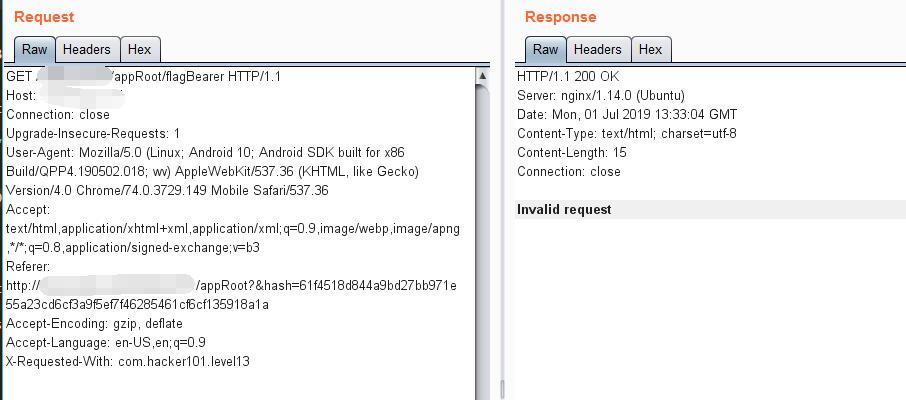
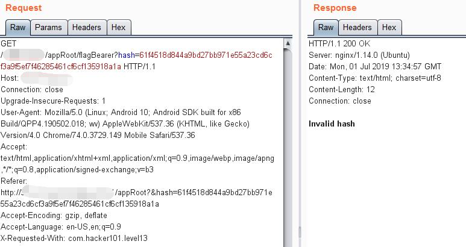
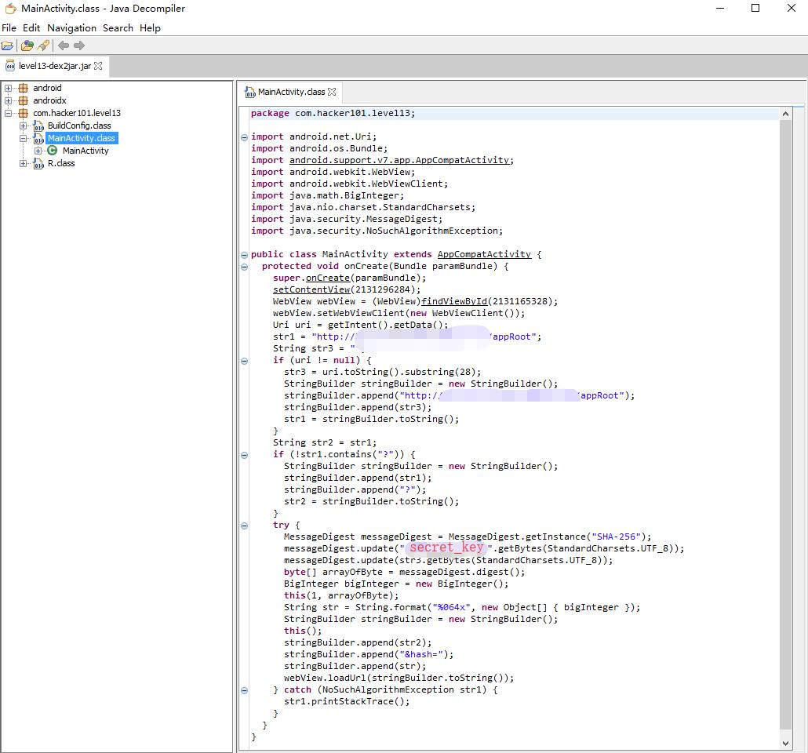
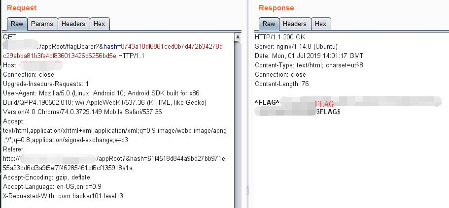

# Intentional Exercise - FLAG0

## 0x00 App Home

On app load, a request is sening to server and got an flag link.


However, the result shows invalid request


## 0x01 Mutate Request

It is a practice to modify all the HTTP parameters you can reach.

It seems always send the same link no matter what parameter I send in request.



But the second request needs more data.



After adding the parameter **hash**, it shows a diffeerent response.



## 0x02 Check Source

As we have the **apk** file, we may check inside of it.

### Dex to Jar

Use [dex2jar][1] to convert to **jar**.

```batch
d2j-dex2jar.bat -f ./level13.apk
```

So we got **level13-dex2jar.jar** now.

### Decompile

Use [jd-gui][1] to chek inside of the **jar**.



## 0x03 Code Review

The full source can be found at [MainActivity.java][3]

```java
MessageDigest messageDigest = MessageDigest.getInstance("SHA-256");
messageDigest.update("s00p3rs3cr3tk3y".getBytes(StandardCharsets.UTF_8));
messageDigest.update(str3.getBytes(StandardCharsets.UTF_8));
byte[] arrayOfByte = messageDigest.digest();
```

The request hash is generated with the secret key **s00p3rs3cr3tk3y** and the message payload **str3** with **SHA-256**

However, the first request [hash][4] is just the secret key without any payload. 

http://127.0.0.1/xxxxxxxxxx/appRoot?&hash=61f4518d844a9bd27bb971e55a23cd6cf3a9f5ef7f46285461cf6cf135918a1a

```
SHA-256(s00p3rs3cr3tk3y) = 61f4518d844a9bd27bb971e55a23cd6cf3a9f5ef7f46285461cf6cf135918a1a
```

## 0x04 Get Hash

There is another piece of code shows the hint.

```java
Uri uri = getIntent().getData();
str3 = uri.toString().substring(28);
```

and

```xml
<data 
	android:scheme="http"
	android:host="level13.hacker101.com" 
/>
```

So the payload string after the index of 28 should be

```java
"http://level13.hacker101.com".substring(28);
```

| uri                | payload     |
| ------------------ | ----------- |
| /appRoot           | null        |
| /appRoot/flagBeare | /flagBearer |

So we need to encrypt **/flagBearer** with secret key **s00p3rs3cr3tk3y** for this hash.

Try use this online [tool][5].

```
SHA-256(s00p3rs3cr3tk3y/flagBearer) = 8743a18df6861ced0b7d472b34278dc29abba81b3fa4cf836013426d6256bd5e
```

## 0x05 FLAG

Create a new get request with the new generated hash. The server will send back FLAG.

http://127.0.0.1/xxxxxxxxxx/appRoot/flagBearer?&hash=8743a18df6861ced0b7d472b34278dc29abba81b3fa4cf836013426d6256bd5e



[1]: https://github.com/pxb1988/dex2jar
[2]: https://github.com/java-decompiler/jd-gui
[3]: ./MainActivity.java
[4]: https://www.cmd5.com/hash.aspx?s=s00p3rs3cr3tk3y
[5]: https://www.cmd5.com/hash.aspx?s=s00p3rs3cr3tk3y/flagBearer