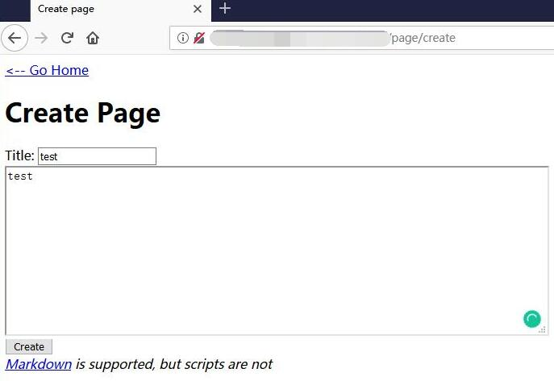
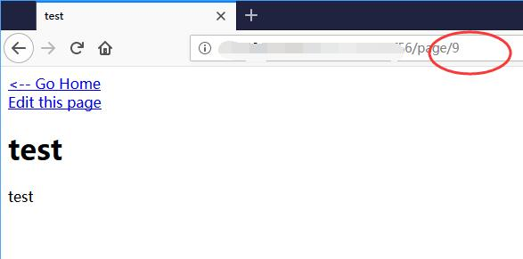
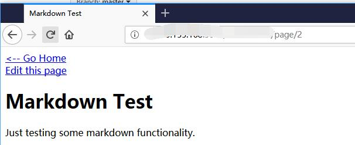
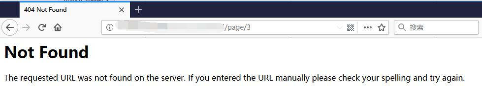
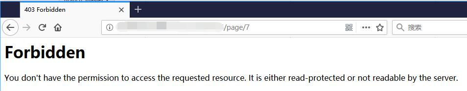
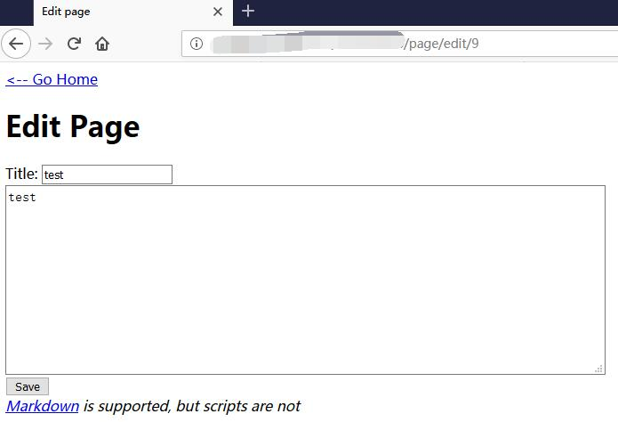
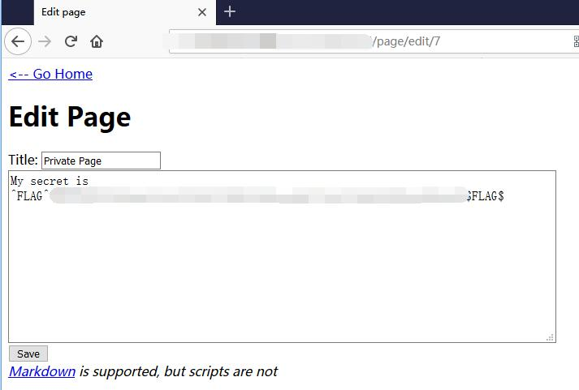

# Micro-CMS v1 - FLAG0

## 0x00 Index

## 0x01 Create New Page

It shows **id=9**

## 0x02 Check Other Pages

The Testing page is 1.

The Markdown Test page is 2.

Should be something between 2 - 9.

Page 3, 4, 5, 6, 8 get 404 error.

But Page 7 has 403 Fobidden error. Need to take a look of Page 7.

## 0x03 Edit Page

## 0x04 FLAG

Change Page id and get the FLAG.

