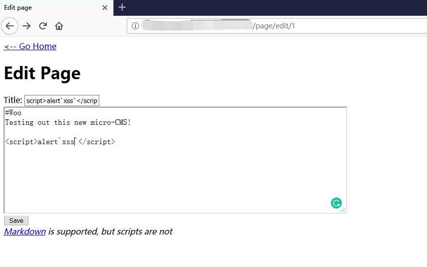
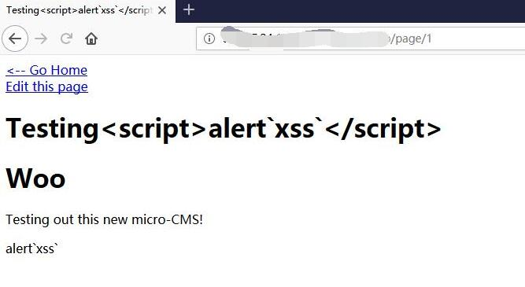
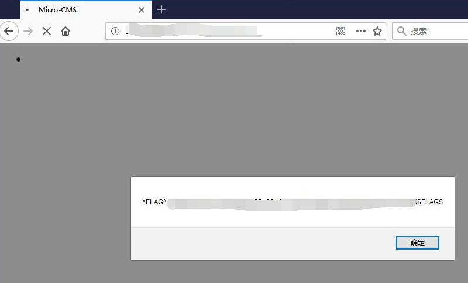

# Micro-CMS v1 - FLAG2

## 0x00 Index


## 0x01 Page 1


## 0x02 Edit Page 1

```html
<script>alert`xss`</script>
```



Save and nothing happened.



## 0x03 FLAG

Go back to home and get the FLAG

