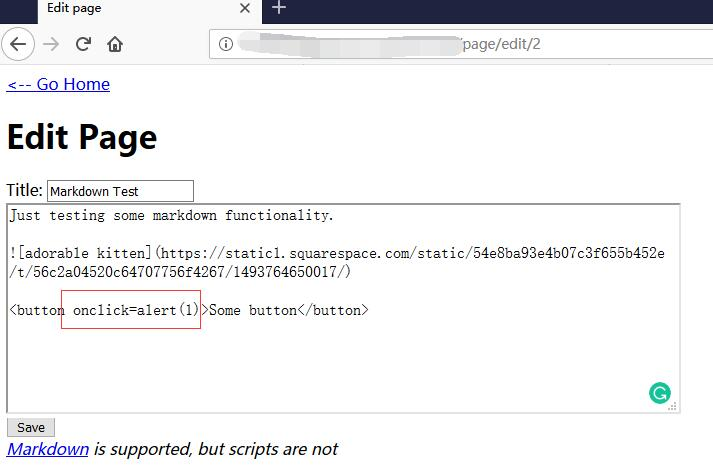
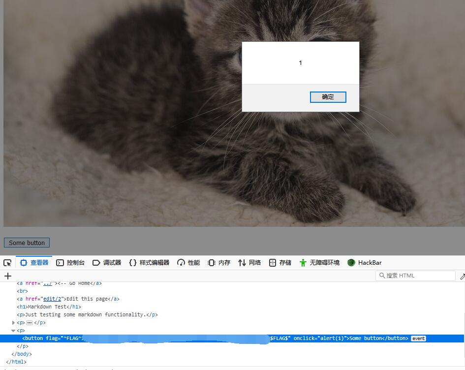

# Micro-CMS v1 - FLAG3

## 0x00 Index


## 0x01 Page 2


## 0x02 Edit Page 2

```html
<button onclick=alert(1)>Some button</button>
```



Save and nothing happened.

## 0x03 FLAG

But the button may trigger an js event. 

Go check the html and get the FLAG.

