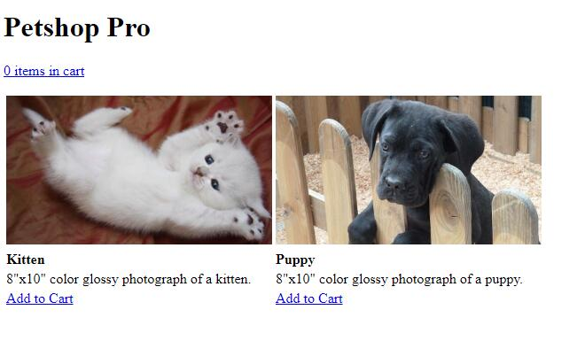
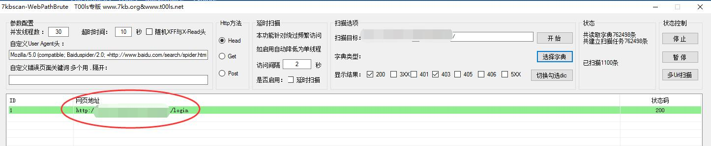
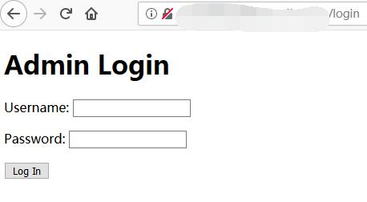
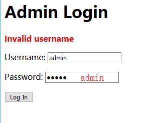
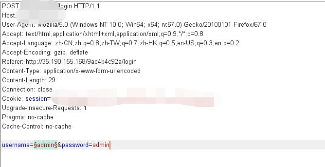
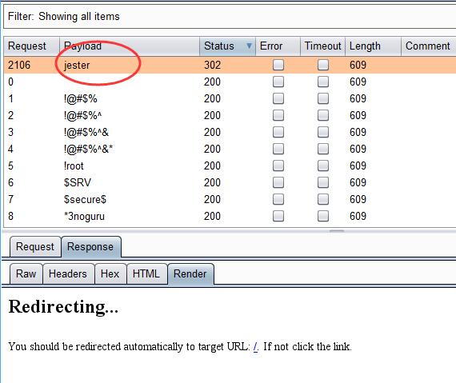
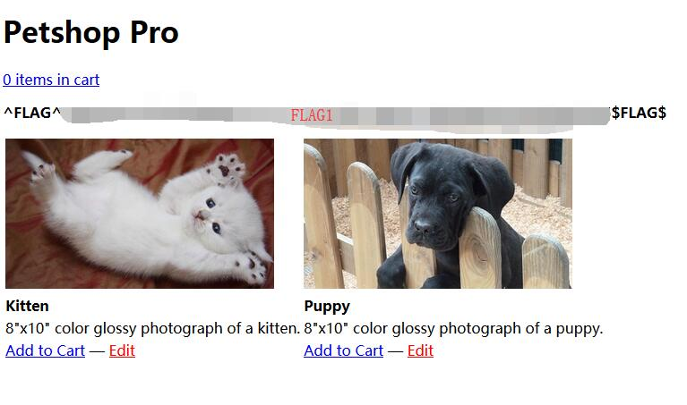

# Petshop Pro - FLAG1

## 0x00 Index



## 0x01 Path Scan

Used [7kbscan-WebPathBrute][1] and corresponding dir dictionary for path scanning.



## 0x02 Admin Login path

http://127.0.0.1/xxxxxxxxxx/login



## 0x03 Try Login

Try with weak password, admin + admin. Shows **Invalid username** error.

This can help to brute force admin username.



## 0x04 Get Username

Catch the request and send to Intruder.



With the help of this [username wordlist][2], finally get the admin username.


## 0x05 Get Password

With pretty much same method as above, here I get the password. 



## 0x06 FLAG

So succefully log in.

```
username=verla
password=jester
```


[1]: https://github.com/7kbstorm/7kbscan-WebPathBrute
[2]: https://github.com/jeanphorn/wordlist/blob/master/usernames.txt