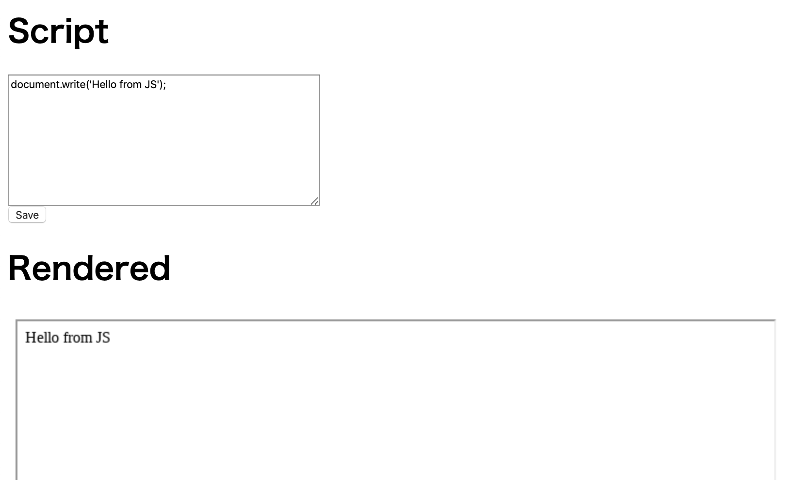
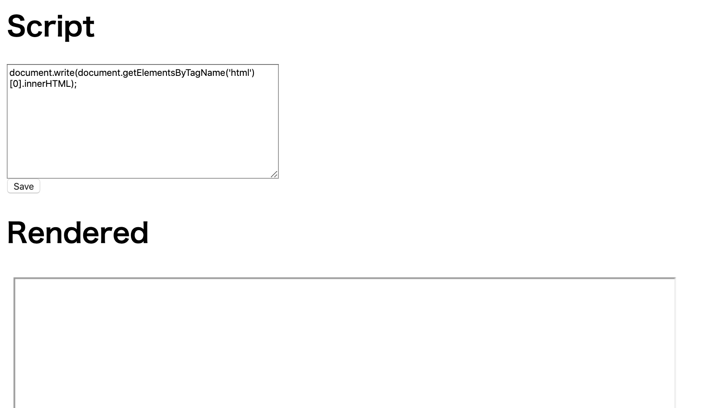
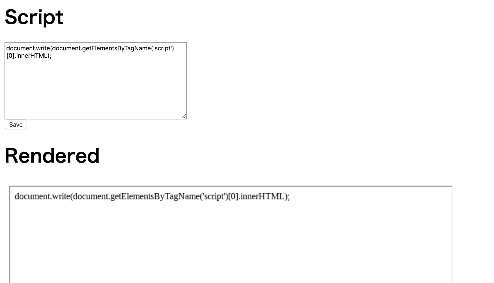
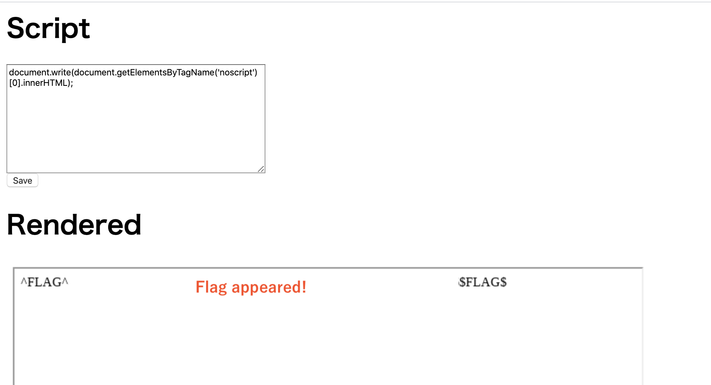

# Rend Asunder - FLAG0

## 0x00 Home



## 0x01 Hey! Show me source code!

```
document.write(document.getElementsByTagName('html')[0].innerHTML);
```



The HTML tags don't seem to be used.

## 0x02 Is there secret javascript?

```
document.write(document.getElementsByTagName('script')[0].innerHTML);
```



There isn't seem to be any secrets.

## 0x03 I know secret
Is it noscript tag ?

```
document.write(document.getElementsByTagName('noscript')[0].innerHTML);
```

