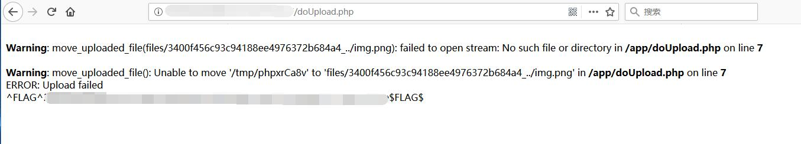

# TempImage - FLAG0

## 0x00 Index


## 0x01 Upload


The image is successfully uploaded to the site.

```
http://127.0.0.1:5001/xxxxxxxxxx/files/d10c88f869301b1238f53cfdff8e9d7c_img.png
```

## 0x02 Modify File Name

Modify file name in Burp

```
Content-Disposition: form-data; name="filename"

../img.png
```

## 0x03 Upload Error and FLAG

