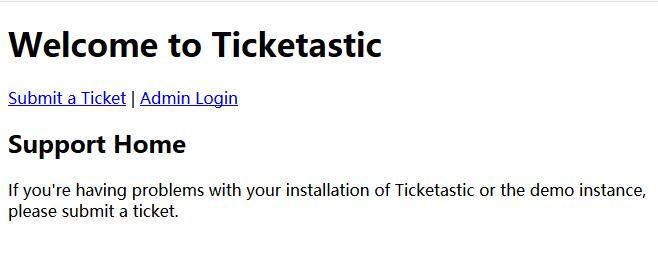
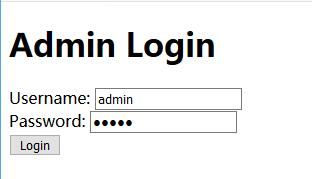
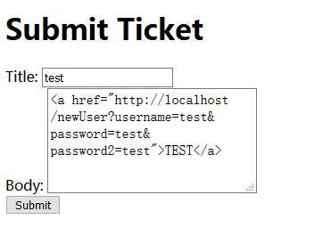
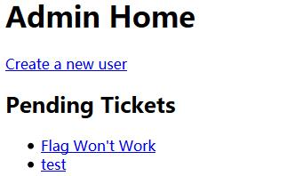
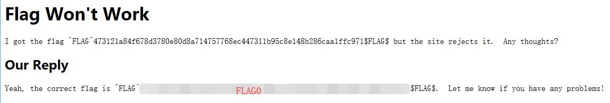

# Ticketastic: Live Instance - FLAG0

## 0x00 Index



## 0x01 Login

Tried login with admin/admin but shows **Invalid Password**.

Also tried to run a wordlist against the password. Still cannot log in.



## 0x02 Submit Ticket

The only thing can be done here is to submit a ticket.

As there is also a **Demo Instance** abailable for looking inside of the system. 

There is a CSRF can be used here which can help to crete a new account.

https://localhost/newUser?username=test&password=test&password2=test

So just submit a ticket with the content below.

``` html
<a href="http://localhost/newUser?username=test&password=test&password2=test">TEST</a>
```



## 0x03 Login with New Account



## 0x04 FLAG

Chek the ticket for FLAG0.

